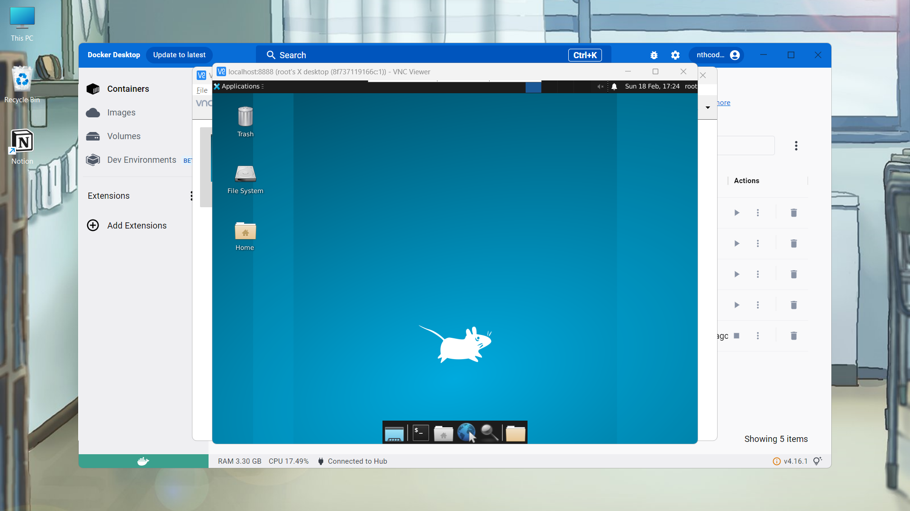

# WEEK_1 

Nguyễn Tiến Hải - 21020066

## 1. `Docker`, `docker-compose` là gì?

### `Docker`

Docker là một nền tảng mở giúp tự động hóa quá trình triển khai, mở rộng và quản lý ứng dụng trong các môi trường cô lập được gọi là containers. Docker giúp tạo ra môi trường phát triển nhất quán, giảm thiểu sự khác biệt giữa các môi trường và tăng tốc độ triển khai ứng dụng.

Docker sử dụng công nghệ containerization để cô lập các ứng dụng và phụ thuộc của chúng vào các containers riêng biệt. Điều này giúp đảm bảo rằng ứng dụng sẽ hoạt động như mong đợi trên bất kỳ hệ thống nào có Docker được cài đặt, bất kể các khác biệt về hệ điều hành hoặc phần cứng cụ thể.

### `docker-compose`

docker-compose là một công cụ giúp định nghĩa và quản lý các dịch vụ Docker đa container. docker-compose cho phép bạn sử dụng một file YAML để định nghĩa các dịch vụ của ứng dụng và các phụ thuộc của chúng. Sau đó, bằng một lệnh duy nhất, bạn có thể tạo và khởi động tất cả các dịch vụ từ cấu hình của mình.

docker-compose giúp đơn giản hóa quá trình cấu hình và quản lý ứng dụng đa container, giúp tăng tốc độ triển khai và giảm thiểu lỗi.

## 2. `Linux` VS `Unix` VS `BSD` hay `*nix`? `macOS` thuộc loại nào?

### `Unix`

- Unix là một hệ điều hành được phát triển vào những năm 1970 tại Bell Labs. Nó đã trở thành cơ sở cho nhiều hệ điều hành khác, bao gồm cả Linux và BSD.

### `Linux`

Linux là một hệ điều hành mã nguồn mở dựa trên Unix. Nó được tạo ra bởi Linus Torvalds vào năm 1991. Linux không phải là một hệ điều hành hoàn chỉnh mà thường được sử dụng với hệ thống GNU để tạo thành hệ điều hành GNU/Linux.

Linux được thiết kế để cung cấp một hệ điều hành miễn phí, mã nguồn mở cho các hệ thống máy tính cá nhân và máy chủ. Nó hỗ trợ một loạt lớn các phần cứng và kiến trúc, từ máy tính xách tay, máy tính để bàn, đến các máy chủ lớn và hệ thống nhúng.

Linux có một cộng đồng lớn các nhà phát triển và người dùng trên toàn thế giới. Cộng đồng này cung cấp sự hỗ trợ và phát triển liên tục cho hệ điều hành, cũng như một loạt các ứng dụng và dịch vụ.

### `BSD`

BSD (Berkeley Software Distribution) là một phiên bản của Unix được phát triển tại Đại học California, Berkeley. BSD được phát hành lần đầu vào năm 1977 và đã trở thành nền tảng cho một số hệ điều hành hiện đại, bao gồm OpenBSD, FreeBSD, và NetBSD.

BSD là mã nguồn mở và được thiết kế để cung cấp một hệ điều hành mạnh mẽ, ổn định và an toàn. Nó hỗ trợ một loạt các kiến trúc phần cứng và cung cấp nhiều tính năng cao cấp, bao gồm hệ thống file ZFS, jails (một công nghệ ảo hóa nhẹ), và PF (một hệ thống tường lửa mạnh mẽ).

BSD có một cộng đồng nhỏ hơn so với Linux, nhưng vẫn rất tích cực và đóng góp nhiều cho sự phát triển của hệ điều hành.

### `*nix`

*nix là một thuật ngữ tổng quát được sử dụng để chỉ tất cả các hệ điều hành dựa trên Unix, bao gồm Unix, Linux, BSD và cả macOS. Thuật ngữ này được sử dụng để chỉ một nhóm rộng lớn các hệ điều hành có nguồn gốc từ Unix, mà không cần phải liệt kê tất cả chúng một cách cụ thể.

Các hệ điều hành *nix thường có các đặc điểm chung như hệ thống file hướng cây, shell scripting, và các công cụ dòng lệnh. Ngoài ra, chúng cũng hỗ trợ đa người dùng và đa tác vụ.

### `macOS`

macOS là hệ điều hành của Apple dành cho máy tính Mac. macOS được xây dựng trên một nền tảng gọi là Darwin, một dự án mã nguồn mở dựa trên BSD. Vì vậy, macOS thuộc loại Unix.

macOS cung cấp một giao diện người dùng đồ họa mạnh mẽ, với nhiều tính năng cao cấp như Time Machine (sao lưu tự động), Spotlight (tìm kiếm nhanh), và Mission Control (quản lý cửa sổ). macOS cũng hỗ trợ các ứng dụng độc quyền của Apple như iMovie, GarageBand, và Final Cut Pro.

## 3. `Alpine` VS `Ubuntu`?

### `Alpine`

Alpine Linux là một hệ điều hành Linux nhẹ nhàng, bảo mật và dễ sử dụng. Nó được thiết kế để tối ưu hóa hiệu suất và bảo mật, với kích thước cài đặt cơ bản rất nhỏ, chỉ khoảng 5MB.

Alpine Linux sử dụng thư viện musl libc và busybox để giảm thiểu tài nguyên hệ thống cần thiết. Nó cũng không sử dụng systemd, một hệ thống init phổ biến trong nhiều hệ điều hành Linux khác, thay vào đó là sử dụng OpenRC.

Alpine Linux thường được sử dụng trong các môi trường Docker và container vì kích thước nhỏ và tập trung vào bảo mật.

#### Điểm mạnh:

- **Nhẹ nhàng**: Alpine Linux có kích thước cài đặt cơ bản rất nhỏ, chỉ khoảng 5MB, giúp giảm bớt tài nguyên hệ thống cần thiết.

- **Bảo mật**: Alpine Linux tập trung vào bảo mật. Nó sử dụng PaX và SSP để ngăn chặn các cuộc tấn công bảo mật, và mặc định không bật các dịch vụ không cần thiết, giúp giảm thiểu rủi ro.

- **Sử dụng musl libc và busybox**: Musl libc là một thư viện C nhẹ nhàng và busybox cung cấp nhiều công cụ Unix cơ bản trong một chương trình duy nhất, giúp giảm bớt tài nguyên hệ thống cần thiết.

- **Không sử dụng systemd**: Thay vào đó, Alpine Linux sử dụng OpenRC, một hệ thống init nhẹ nhàng và dễ sử dụng.

- **Tương thích với Docker**: Kích thước nhỏ gọn và tập trung vào bảo mật của Alpine Linux làm cho nó trở thành một lựa chọn phổ biến cho các môi trường Docker và container.

#### Điểm hạn chế:

- **Tương thích**: Do sử dụng musl libc thay vì glibc (thư viện C phổ biến trong nhiều hệ điều hành Linux khác), một số phần mềm không tương thích với Alpine Linux mà không cần chỉnh sửa.

- **Tài liệu**: Tài liệu của Alpine Linux không toàn diện bằng một số hệ điều hành Linux khác như Ubuntu hay Fedora.

- **Cộng đồng hỗ trợ**: Cộng đồng hỗ trợ của Alpine Linux không lớn bằng các hệ điều hành Linux phổ biến khác.

### `Ubuntu`

Ubuntu là một hệ điều hành mã nguồn mở dựa trên Debian GNU/Linux. Nó được phát triển bởi công ty Canonical Ltd., và được cung cấp miễn phí với sự hỗ trợ cộng đồng.

Ubuntu có thể được sử dụng cho nhiều mục đích khác nhau, bao gồm:

- **Máy tính cá nhân**: Ubuntu có giao diện người dùng thân thiện và dễ sử dụng, làm cho nó trở thành lựa chọn tốt cho người mới sử dụng Linux.

- **Máy chủ**: Ubuntu Server là một phiên bản của Ubuntu được tối ưu hóa cho môi trường máy chủ. Nó bao gồm các công cụ và dịch vụ cần thiết để cài đặt và quản lý máy chủ.

- **Phát triển phần mềm**: Ubuntu cung cấp một môi trường phát triển phần mềm mạnh mẽ với nhiều công cụ và thư viện sẵn có.

- **Cloud và ảo hóa**: Ubuntu cũng được sử dụng rộng rãi trong các môi trường cloud và ảo hóa, với sự hỗ trợ cho các công nghệ như Docker và Kubernetes.

#### Điểm mạnh:

- **Dễ sử dụng**: Ubuntu có giao diện người dùng thân thiện và dễ sử dụng, làm cho nó trở thành lựa chọn tốt cho người mới sử dụng Linux.

- **Hỗ trợ phần cứng rộng rãi**: Ubuntu hỗ trợ một loạt các thiết bị phần cứng và đi kèm với các trình điều khiển sẵn có.

- **Cộng đồng hỗ trợ lớn**: Ubuntu có một cộng đồng người dùng và nhà phát triển lớn, cung cấp nhiều tài liệu hỗ trợ và hướng dẫn.

- **Cập nhật thường xuyên**: Ubuntu có lịch trình phát hành định kỳ, với các phiên bản mới được phát hành mỗi sáu tháng.

#### Điểm hạn chế:

- **Tài nguyên hệ thống**: Ubuntu có thể yêu cầu nhiều tài nguyên hệ thống hơn so với một số hệ điều hành Linux nhẹ nhàng khác.

- **Quảng cáo và dữ liệu người dùng**: Một số phiên bản của Ubuntu đã bị chỉ trích vì việc thu thập dữ liệu người dùng và hiển thị quảng cáo trong kết quả tìm kiếm.

## `VNC` (Virtual Network Computing)

VNC, hay Virtual Network Computing, là một hệ thống cho phép người dùng tương tác với một máy tính từ xa thông qua một kết nối mạng. Nó truyền tải sự kiện chuột và bàn phím từ máy khách (client) đến máy chủ (server) và trả lại các cập nhật màn hình.

VNC được sử dụng rộng rãi trong việc hỗ trợ kỹ thuật từ xa, quản lý máy chủ, giáo dục và nhiều ứng dụng khác. Nó hoạt động trên nhiều hệ điều hành, bao gồm Windows, macOS, Linux và nhiều hệ điều hành di động.

#### Điểm mạnh:

- **Độc lập với nền tảng**: VNC hoạt động trên nhiều hệ điều hành, bao gồm Windows, macOS, Linux và nhiều hệ điều hành di động.

- **Đơn giản và dễ sử dụng**: VNC dễ cài đặt và sử dụng, ngay cả với những người không có nhiều kinh nghiệm về công nghệ.

- **Cho phép truy cập từ xa**: VNC cho phép người dùng tương tác với máy tính từ xa, giúp hỗ trợ kỹ thuật, quản lý máy chủ, giáo dục và nhiều ứng dụng khác.

#### Điểm hạn chế:

- **Hiệu suất**: VNC có thể chậm hơn so với một số giải pháp truy cập từ xa khác, đặc biệt là khi mạng chậm hoặc không ổn định.

- **Bảo mật**: Mặc dù VNC có thể được cấu hình để sử dụng mã hóa, nhưng nó không được bật theo mặc định, có thể tạo ra các vấn đề bảo mật.


## Phần thực hành

**Bước 1: Xây dựng image từ Dockerfile**

Trước tiên, mở terminal và điều hướng đến thư mục chứa Dockerfile của bạn. Sau đó, chạy lệnh sau để xây dựng image:

```docker docker build -t your-image-name .```

Trong đó, ```your-image-name``` là tên mà bạn muốn đặt cho image Docker của mình. Dấu chấm (.) cuối cùng trong lệnh nói cho Docker biết bạn muốn xây dựng image từ Dockerfile trong thư mục hiện tại.


**Bước 2: Chạy container từ image**

Sau khi bạn đã xây dựng image, bạn có thể chạy một container từ image đó bằng cách sử dụng lệnh docker run, ở đây mình sẽ ánh xạ cổng, cụ thể là ánh xạ cổng 8888 của máy chủ của bạn đến cổng 5901 của container, bạn có thể chạy lệnh sau:

```docker run -it -p 8888:5901 your-image-name```


**Bước 3: Khởi tạo và chạy vncserver**

Đầu tiên chúng ta phải vào container bằng lệnh:

```docker exec -u 0 -it container_id_or_name /bin/bash```

Sau khi đã vào được container, ta chạy lệnh sau để set user:

```export USER=root```

Sau đó vì phần vncserver đã được cài đặt và set password trước trong Dockerfile, nên ở đây chúng ta sẽ chỉ cần chạy VNC server bằng lệnh:

```vncserver```

Nếu xuất hiện log tương tự như sau:
```
Warning: c9c0a1d930f5:1 is taken because of /tmp/.X1-lock
Remove this file if there is no X server c9c0a1d930f5:1
```

Đơn giản sẽ chỉ cần xóa file ```.X1-lock``` bằng lệnh: ```rm /tmp/.X1-lock``` và reset lại VNC server là có thể đến bước tiếp theo.


**Bước 4: Kết nối sử dụng VNC Viewer**

Ta sẽ kết nối đến cổng ```127.0.0.1:8888``` như đã config ở các bước trước đây, và ta sẽ có màn hình hiện lên như trên:


Tiếp tục, nhập mật khẩu mà bạn đã đặt và ta đã có 1 màn hình như sau:


